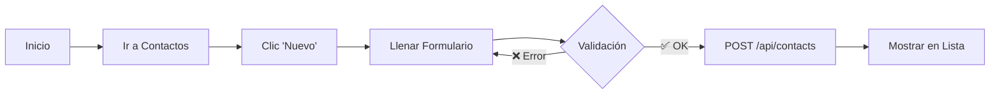

# Autor
Julian Santamaria


# 🏢 Sistema de Gestión Empresarial CRUD

> Aplicación web SPA desarrollada con JavaScript vanilla para la gestión integral de sucursales, ciudades, países, contactos, empresas y regiones.


---

## 📋 Tabla de Contenidos

- [Descripción](#-descripción)
- [Características](#-características)
- [Tecnologías](#-tecnologías)
- [Estructura del Proyecto](#-estructura-del-proyecto)
- [Requisitos Previos](#-requisitos-previos)
- [Instalación](#-instalación)
- [Uso](#-uso)
- [API Endpoints](#-api-endpoints)
- [Troubleshooting](#-troubleshooting)
- [Contribuciones](#-contribuciones)
- [Licencia](#-licencia)

---

## 🎯 Descripción

Sistema web moderno de tipo **Single Page Application (SPA)** que implementa operaciones CRUD completas para la gestión de datos empresariales. Desarrollado con **JavaScript vanilla** sin dependencias de frameworks, utilizando Web Components para máxima modularidad y rendimiento.

**Entidades Gestionadas:**
- 👥 Contactos
- 🌍 Países
- 📍 Regiones
- 🏙️ Ciudades
- 🏪 Sucursales
- 🏢 Empresas

---

## ✨ Características

### Funcionalidades Principales

| Característica | Descripción |
|----------------|-------------|
| **🔄 CRUD Completo** | Crear, Leer, Actualizar y Eliminar para todas las entidades |
| **📱 Responsive** | Interfaz adaptable a dispositivos móviles y desktop |
| **🧩 Modular** | Web Components personalizados para cada sección |
| **⚡ Rápido** | Sin frameworks pesados, solo JavaScript vanilla |
| **🎨 UI Moderna** | Estilos CSS modulares con clases Bootstrap-like |
| **🛡️ Validaciones** | Validación de formularios en tiempo real |
| **⚠️ Manejo de Errores** | Alertas informativas para errores de API y validaciones |
| **🔌 API REST** | Integración completa con backend RESTful |

---

## 🛠️ Tecnologías

### Frontend

```javascript
// ES6+ Modules
import { Component } from './components';

// Web Components
customElements.define('nav-menu', NavMenu);

// Async/Await para APIs
const data = await fetch('/api/contacts');
```

**Stack Tecnológico:**
- **JavaScript ES6+**: Módulos, async/await, clases
- **Web Components**: Custom Elements nativos
- **CSS3**: Estilos modulares y responsivos
- **Fetch API**: Comunicación con backend

### Backend (Requerido)

- **Node.js** + **Express**: API RESTful
- **Puerto**: `localhost:3000`
- **Base de Datos**: SQLite/MongoDB (configurable)

### Herramientas de Desarrollo

- **VS Code** con Live Server
- **Chrome/Firefox DevTools** para debugging
- **Git** para control de versiones

---

## 📁 Estructura del Proyecto

```
Tjavascript/
│
├── 📄 index.html                    # Punto de entrada principal
│
└── App/
    │
    ├── Components/                   # 🧩 Web Components
    │   ├── app.js                   # Inicializador principal
    │   │
    │   ├── navMenu/                 # Menú de navegación
    │   │   ├── navMenu.js
    │   │   └── menuStyle.css
    │   │
    │   ├── contacto/                # Gestión de contactos
    │   │   ├── contactoComponent.js
    │   │   ├── regContacto.js       # Formulario registro
    │   │   ├── lstContacto.js       # Lista/Tabla
    │   │   └── contactoStyle.css
    │   │
    │   ├── countries/               # Gestión de países
    │   │   ├── countryComponent.js
    │   │   ├── regcountry.js
    │   │   ├── lstcountry.js
    │   │   └── countryStyle.css
    │   │
    │   ├── regions/                 # Gestión de regiones
    │   │   ├── regionComponent.js
    │   │   ├── regregion.js
    │   │   ├── lstregion.js
    │   │   └── regionStyle.css
    │   │
    │   ├── cities/                  # Gestión de ciudades
    │   │   ├── cityComponent.js
    │   │   ├── regcity.js
    │   │   ├── lscity.js
    │   │   └── cityStyle.css
    │   │
    │   ├── branches/                # Gestión de sucursales
    │   │   ├── branchesComponent.js
    │   │   ├── regbranches.js
    │   │   ├── lsbranches.js
    │   │   └── branchesStyle.css
    │   │
    │   └── companies/               # Gestión de empresas
    │       ├── companiesComponent.js
    │       ├── regcompanies.js
    │       ├── lscompanies.js
    │       └── companiesStyle.css
    │
    ├── Apis/                        # 🔌 Clientes API
    │   ├── contact/
    │   │   └── contactApi.js
    │   ├── countries/
    │   │   └── countriesApi.js
    │   ├── regions/
    │   │   └── regionsApi.js
    │   ├── cities/
    │   │   └── citiesApi.js
    │   ├── branches/
    │   │   └── branchesApi.js
    │   └── companies/
    │       └── companiesApi.js
    │
    └── Models/                      # 📊 Modelos de datos (opcional)
        ├── CityModel.js
        ├── CompanyModel.js
        ├── BranchModel.js
        └── ...
```

### 📝 Notas Importantes

> ⚠️ **Rutas Relativas**: Usa siempre rutas relativas en imports  
> ⚠️ **CSS**: Carga vía `<link>` en `index.html`, no como módulos ES  
> ⚠️ **Modelos**: Carpeta opcional, elimina imports si no la usas

---

## 🔧 Requisitos Previos

Antes de comenzar, asegúrate de tener instalado:

- ✅ **Editor de código** (VS Code recomendado)
- ✅ **Navegador moderno** (Chrome/Firefox)

### Backend API (Obligatorio)

El backend debe implementar los siguientes endpoints:

| Método | Endpoint | Descripción |
|--------|----------|-------------|
| GET | `/api/{entity}` | Listar todos |
| POST | `/api/{entity}` | Crear nuevo |
| PUT | `/api/{entity}/:id` | Actualizar existente |
| DELETE | `/api/{entity}/:id` | Eliminar |

Donde `{entity}` puede ser: `contacts`, `countries`, `regions`, `cities`, `branches`, `companies`

---

## 🚀 Instalación

### Paso 1: Clonar o Descargar

```bash
# Opción 1: Clonar repositorio
git clone https://github.com/tu-usuario/tu-repo.git
cd tu-repo

# Opción 2: Descargar ZIP
# Extraer archivos en carpeta 'Tjavascript/'
```

### Paso 2: Configurar Backend

Crea un servidor Express básico:

```javascript
// server.js
const express = require('express');
const cors = require('cors');
const app = express();

app.use(cors());
app.use(express.json());

// Ejemplo: Endpoint de contactos
app.get('/api/contacts', (req, res) => {
  // Lógica para obtener contactos de la DB
  res.json([/* array de contactos */]);
});

app.post('/api/contacts', (req, res) => {
  // Lógica para crear contacto
  res.status(201).json({ id: 1, ...req.body });
});

// ... más endpoints para PUT, DELETE y otras entidades

app.listen(3000, () => {
  console.log('🚀 Backend corriendo en http://localhost:3000');
});
```

Ejecutar backend:

```bash
node server.js
# o con nodemon para auto-reload
nodemon server.js
```

### Paso 3: Configurar Frontend

**Editar `index.html`:**

```html
<!DOCTYPE html>
<html lang="es">
<head>
  <meta charset="UTF-8">
  <meta name="viewport" content="width=device-width, initial-scale=1.0">
  <title>Sistema de Gestión Empresarial</title>
  
  <!-- Estilos CSS -->
  <link rel="stylesheet" href="./App/Components/navMenu/menuStyle.css">
  <link rel="stylesheet" href="./App/Components/contacto/contactoStyle.css">
  <!-- ... otros estilos -->
</head>
<body>
  <div id="appContainer"></div>
  
  <!-- Script principal -->
  <script type="module" src="./App/Components/app.js"></script>
</body>
</html>
```

### Paso 4: Ejecutar Aplicación

**Con VS Code Live Server:**

1. Instalar extensión "Live Server"
2. Clic derecho en `index.html`
3. Seleccionar **"Open with Live Server"**
4. La app se abrirá en `http://127.0.0.1:5500`

**Con servidor HTTP simple:**

```bash
# Python 3
python -m http.server 5500

# Node.js (http-server)
npx http-server -p 5500
```

---

## 📖 Uso

### Navegación Básica

1. **Abrir aplicación**: `http://127.0.0.1:5500`
2. **Seleccionar sección**: Usa el menú lateral
3. **Realizar operaciones CRUD**:

#### ➕ Crear Registro

```
1. Clic en botón "Nuevo"
2. Completar formulario
3. Clic en "Guardar"
✅ Registro creado exitosamente
```

#### ✏️ Editar Registro

```
1. Clic en "Editar" en la lista
2. Modificar campos necesarios
3. Clic en "Guardar"
✅ Registro actualizado
```

#### 🗑️ Eliminar Registro

```
1. Clic en "Eliminar" en la lista
2. Confirmar acción
✅ Registro eliminado
```

### Ejemplo de Flujo: Agregar Contacto



---

## 🔌 API Endpoints

### Formato de Datos

Todos los endpoints usan **JSON** para request/response.

#### 👥 Contactos (`/api/contacts`)

```json
{
  "id": 1,
  "name": "Juan Pérez",
  "email": "juan@empresa.com",
  "phone": "+57 300 123 4567"
}
```

#### 🌍 Países (`/api/countries`)

```json
{
  "id": 1,
  "name": "Colombia",
  "isoCode": "CO"
}
```

#### 📍 Regiones (`/api/regions`)

```json
{
  "id": 1,
  "name": "Santander",
  "countryId": 1
}
```

#### 🏙️ Ciudades (`/api/cities`)

```json
{
  "id": 1,
  "name": "Bucaramanga",
  "countryId": 1
}
```

#### 🏪 Sucursales (`/api/branches`)

```json
{
  "id": 1,
  "name": "Sucursal Centro",
  "address": "Calle 35 #10-43",
  "companyId": 1,
  "cityId": 1
}
```

#### 🏢 Empresas (`/api/companies`)

```json
{
  "id": 1,
  "name": "Tech Solutions SAS",
  "nit": "900123456-7",
  "contactId": 1
}
```

### Respuestas de Error

```json
{
  "error": "Mensaje descriptivo del error",
  "code": 400
}
```

**Códigos HTTP Comunes:**
- `200 OK`: Operación exitosa
- `201 Created`: Recurso creado
- `400 Bad Request`: Datos inválidos
- `404 Not Found`: Recurso no encontrado
- `500 Internal Server Error`: Error del servidor

---

## 🔥 Troubleshooting

### ❌ Página en Blanco / Errores 404

**Síntomas:**
- Consola muestra errores 404
- Página no carga componentes


```

**Verificar estructura:**

```bash
ls -R App/Components/
# Debe mostrar todas las carpetas y archivos
```

### ⚠️ Errores de API

**Síntomas:**
- "La URL no es correcta"
- "Network error"

**Checklist:**

- [ ] Backend corriendo en `localhost:3000`
- [ ] CORS habilitado en backend
- [ ] URL_API correcta en archivos `*Api.js`

**Habilitar CORS en Express:**

```javascript
const cors = require('cors');
app.use(cors());
```

### 🎨 Error de MIME Type (CSS)

**Error:**
```
Refused to apply style because MIME type ('text/html') is not 'text/css'
```

**Solución:**
- ❌ No importes CSS como módulos JS
- ✅ Usa `<link>` tags en `index.html`

### 📭 Lista Vacía

**Causas posibles:**
1. Backend sin datos de prueba
2. CORS no configurado
3. Endpoint incorrecto

**Debugging:**

```javascript
// Agregar console.log en API
console.log('📡 Fetching data from:', URL_API);
fetch(URL_API)
  .then(res => {
    console.log('📥 Response status:', res.status);
    return res.json();
  })
  .then(data => console.log('📊 Data received:', data));
```

### 🔍 Tips de Depuración

| Herramienta | Uso |
|-------------|-----|
| **Console (F12)** | Ver logs y errores JavaScript |
| **Network Tab** | Verificar requests/responses HTTP |
| **Elements Tab** | Inspeccionar DOM y estilos CSS |
| **Application Tab** | Verificar Local Storage (no usado aquí) |

**Logs útiles:**

```javascript
console.log('🔄 Componente cargando...');
console.log('✅ Datos obtenidos:', data);
console.error('❌ Error:', error);
```

---


### Convenciones de Commits

Usa emojis para commits más descriptivos:

- ✨ `:sparkles:` Nueva característica
- 🐛 `:bug:` Corrección de bug
- 📝 `:memo:` Documentación
- 🎨 `:art:` Mejoras de estilo/formato
- ⚡ `:zap:` Mejora de rendimiento
- 🔒 `:lock:` Seguridad

---

## 📄 Licencia

Este proyecto está bajo la **Licencia MIT**.

```
MIT License

Copyright (c) 2025 [Tu Nombre]

Se concede permiso para usar, copiar, modificar y distribuir este software...
```

Ver archivo [LICENSE](LICENSE) para más detalles.

---

